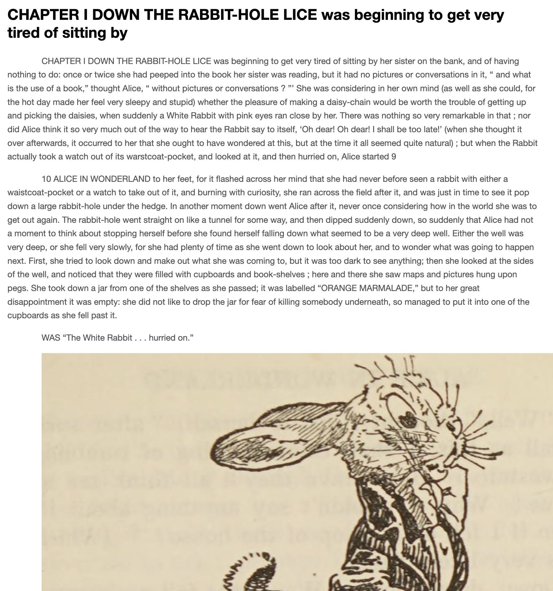

# rbook-utils

[](https://crates.io/crates/rbook-utils)
[](https://docs.rs/rbook-utils)
[](LICENSE)

`rbook-utils` is a high-level wrapper over `rbook` — to conveniently parse, convert, and render ebooks for downstream consumption (e.g., into Markdown).

## Demo



[Example output of `rbook-utils`](assets/outputs/Alice_s_adventures_in_wonderland_and_Through_the_looking_glass.md) on [Alice's Adventures in Wonderland](https://en.wikipedia.org/wiki/Alice%27s_Adventures_in_Wonderland)

## Examples

### API

```rust
use std::path::PathBuf;

use rbook_utils::{
    convert_all, ChapterFallbackMode, ConvertOptions, CssMode, FilenameScheme, FormatMode,
    MediaMode, NotesMode,
};

fn main() -> anyhow::Result<()> {
    let mut options = ConvertOptions::new(
        PathBuf::from("assets"),
        PathBuf::from("results"),
    );

    options.format = FormatMode::Rich;
    options.css = CssMode::Inline;
    options.media = MediaMode::All;
    options.split_chapters = true;
    options.chapter_fallback = ChapterFallbackMode::Auto;
    options.notes_mode = NotesMode::ChapterEnd;
    options.filename_scheme = FilenameScheme::Index;

    let summary = convert_all(&options)?;

    for book in &summary.books {
        println!("{} -> {:?}", book.title, book.output_path);
    }

    Ok(())
}
```

### CLI

```bash
cargo run -- --input assets --output results --format rich --css inline --media all --split-chapters
```

## Options

| Option | Values | Default | Description |
| --- | --- | --- | --- |
| `--input` | path | `assets` | Input EPUB file or directory to scan recursively for `.epub` files. |
| `--output` | path | `rbook-utils/results` | Root output location for generated Markdown and extracted assets. |
| `--media` | `none`, `image`, `all` | `image` | Choose whether to extract no media, referenced images only, or images plus manifest audio/video. |
| `--format` | `plain`, `rich` | `plain` | Output plain Markdown or preserve richer HTML where needed. |
| `--split-chapters` | flag | `false` | Write one Markdown file per section/chapter instead of a single combined file. |

### Advanced

| Option | Values | Default | Description |
| --- | --- | --- | --- |
| `--css` | `inline`, `external` | `inline` | For rich output, embed stylesheet content inline or write linked CSS files. |
| `--chapter-fallback` | `off`, `auto`, `force` | `auto` | Control whether chapter boundaries are inferred from headings when TOC segmentation is weak. |
| `--notes-mode` | `inline`, `chapter-end`, `global` | `inline` | Keep footnotes inline, move them to each chapter end, or emit a global notes section/file. |
| `--export-manifest` | `off`, `v1` | `off` | Write `manifest.v1.json` with source-to-output mapping and asset metadata. |
| `--quality-report` | `off`, `v1` | `off` | Write `report.v1.json` with TOC, cleanup, asset, and link diagnostics. |
| `--ocr-cleanup` | `off`, `basic`, `aggressive` | `off` | Apply OCR cleanup heuristics to extracted section text. |
| `--nav-cleanup` | `off`, `auto` | `auto` | Deduplicate and trim noisy TOC/navigation entries before sectioning. |
| `--filename-scheme` | `index`, `hash` | `index` | Choose split-chapter output filenames by section order or stable content hash. |

## Acknowledgements

- Huge shout out to [Devin Sterling](https://github.com/devinsterling) for creating the excellent [`rbook`](https://crates.io/crates/rbook) crate!!!

## License

Apache 2.0
